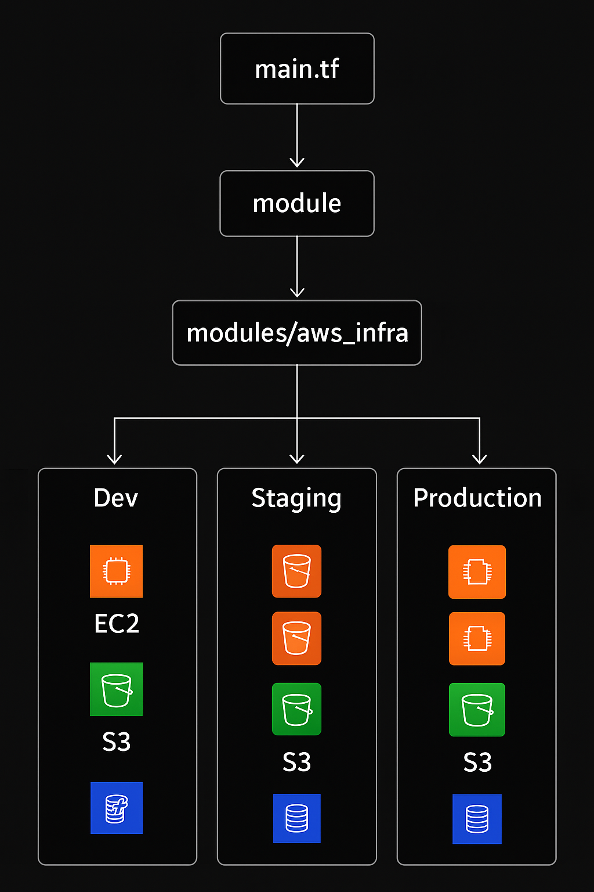

# Multi-Environment AWS Infrastructure using Terraform

## 📌 Overview
This project provisions **multi-environment AWS infrastructure** (Development, Staging, and Production) using **Terraform modules** for reusability and maintainability.  
Each environment creates:
- **EC2 Instances** with specified instance types and counts
- **S3 Bucket** for environment-specific storage
- **DynamoDB Table** for application data storage
- **Security Groups** for controlled access
- **Key Pair** for secure SSH access

By using Terraform modules, we avoid code duplication and can easily manage resources across environments.

---

## 🏗 Project Structure
```

.
├── main.tf                # Root module calling child modules for each environment
├── outputs.tf             # Outputs for all environments
├── providers.tf           # AWS provider configuration
├── terraform.tf           # Required provider & version setup
├── modules/
│   └── aws\_infra/         # Reusable Terraform module
│       ├── my\_buckets.tf  # S3 bucket creation
│       ├── my\_instance.tf # EC2 instance + KeyPair + SG
│       ├── my\_table.tf    # DynamoDB table
│       ├── my\_variables.tf# Module variables
│       ├── outputs.tf     # Module outputs (EC2 IPs)

````

---


## 📊 Architecture Diagram



---

## 🚀 Features

* **Multi-environment setup**: `dev`, `staging`, `prod`
* **Reusable module**: Same infrastructure logic with different variables
* **Environment-specific configuration** (instance size, count, tags, etc.)
* **AWS resources created**:

  * EC2 Instances
  * S3 Bucket
  * DynamoDB Table
  * Security Group
  * SSH Key Pair
  * Default VPC

---

## ⚙️ Prerequisites

Before running this project, ensure you have:

* [Terraform](https://developer.hashicorp.com/terraform/downloads) `>= 1.0.0`
* AWS Account with programmatic access
* AWS CLI installed & configured (`aws configure`)
* SSH public key available at:

```
C:/Users/ADMIN/OneDrive/Desktop/terraform/multi-env/terra-key.pub
```

---

## 📂 Module Inputs

| Variable         | Type   | Description             | Example                 |
| ---------------- | ------ | ----------------------- | ----------------------- |
| `my-env`         | string | Environment name        | `dev`                   |
| `ami_id`         | string | AMI ID for EC2 instance | `ami-0144277607031eca2` |
| `instance_type`  | string | EC2 instance type       | `t2.micro`              |
| `instance_count` | number | Number of EC2 instances | `1`                     |

---

## 📦 Outputs

| Output Name                | Description                                  |
| -------------------------- | -------------------------------------------- |
| `ec2_instances_public_ips` | Public IP addresses of created EC2 instances |

---

## 🛠 Usage

### 1️⃣ Clone the Repository

```bash
git clone https://github.com/<your-username>/<your-repo>.git
cd <your-repo>
```

### 2️⃣ Initialize Terraform

```bash
terraform init
```

### 3️⃣ Plan the Deployment

```bash
terraform plan
```

### 4️⃣ Apply the Changes

```bash
terraform apply
```

Confirm with `yes` when prompted.

### 5️⃣ View Outputs

```bash
terraform output
```

---

## 📊 Example Deployment

When you run `terraform apply`, resources will be created for all three environments:

* **Dev**:

  * 1 × `t2.micro` instance
  * 1 S3 bucket
  * 1 DynamoDB table

* **Staging**:

  * 2 × `t2.medium` instances
  * 1 S3 bucket
  * 1 DynamoDB table

* **Production**:

  * 3 × `t2.large` instances
  * 1 S3 bucket
  * 1 DynamoDB table

---

## 🔐 Security Notes

* The security group opens port **22** to the world (`0.0.0.0/0`) for SSH access.
  🔴 *Change this to your own IP in production for better security.*
* Do not commit your private key to GitHub.
* Ensure the S3 bucket names are globally unique.

---

## 🗑 Cleanup

To destroy all resources:

```bash
terraform destroy
```

Confirm with `yes` when prompted.

---

## 📄 License

This project is open-source and available under the [MIT License](LICENSE).

---

## 👩‍💻 Author

**Vaibhavi Sugandhi**
DevOps Engineer in making 🚀

```

---

